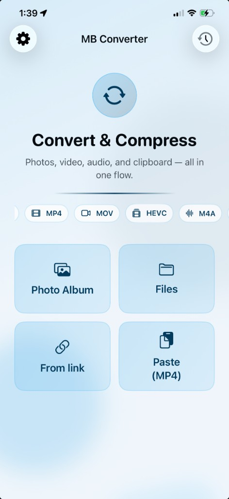
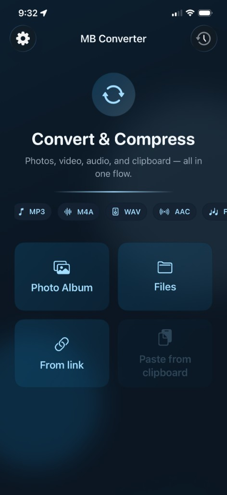

# MB Converter

**Convert and compress** photos, video, and audio on your iPhone and iPad, one simple flow from choosing a format to picking where your file comes from. MB Converter is completely free and open source.

## Get the beta

<p>
  <a href="https://testflight.apple.com/join/FEA9U9HB">
    
  </a>
</p>

**App Icon**


**Main Screen Preview**

<table>
  <tr>
    <td align="center">
      <strong>Light</strong><br />
      
    </td>
    <td align="center">
      <strong>Dark</strong><br />
      
    </td>
  </tr>
</table>

## Supported formats

| Files | Codecs we can read |
|-------|--------------------|
| Video: MP4, MOV, M4V, MKV, WebM, AVI, FLV, F4V, TS, MTS, M2TS, 3GP, MPEG/MPG, M2V, MXF, OGV, VOB, ASF, WMV, WTV, SWF, HEVC, MJPEG | H.264, HEVC, VP8, VP9, MPEG-2, MPEG-4, MJPEG, Theora |
| Audio: MP3, M4A, WAV, AAC, FLAC, OGG, Opus, ALAC | AAC, MP3, FLAC, ALAC, Vorbis, Opus, PCM |
| Photos: JPEG, PNG, HEIC, WebP, AVIF, TIFF | handled by iOS |
| Animated: GIF | — |

### What you can save out

| Output | Codec used |
|--------|------------|
| MP4 (H.264) | H.264 |
| MP4 (HEVC) | HEVC |
| MOV | H.264 |
| M4A | AAC |
| AAC | AAC |
| WAV | PCM 16-bit |
| JPEG | — |
| PNG | — |
| HEIC | — |
| WebP (still image) | — |
| TIFF | — |

## Web app

This repository also includes a browser-only web version in [`web/`](web/). It keeps the iOS color theme and conversion flow, but runs FFmpeg through WebAssembly in the browser instead of uploading media to a server.

```sh
cd web
npm install
npm run dev
```

The web build serves FFmpeg assets from the same origin and sets COOP/COEP headers for the multi-threaded wasm backend. Browser support, available memory, and the loaded FFmpeg core determine which large files/codecs can be processed.

### GitHub Pages

The web app is deployable to GitHub Pages with the included workflow in
`.github/workflows/deploy-web-pages.yml`. Pages hosts static files only and does
not allow custom COOP/COEP response headers, so the deployed app uses the
single-thread FFmpeg wasm fallback there. Local Vite dev/preview still uses the
multi-thread core when the browser is cross-origin isolated.

## For developers

Building from source or curious about how it’s put together? See the **[Developer documentation](docs/DEVELOPMENT.md)**.

## License

The app’s source code is under the [MIT License](LICENSE). The libraries it relies on keep their own licenses — see the developer doc for the full list.

## More projects

Check out our other projects at [marginally-better.app](https://marginally-better.app).
