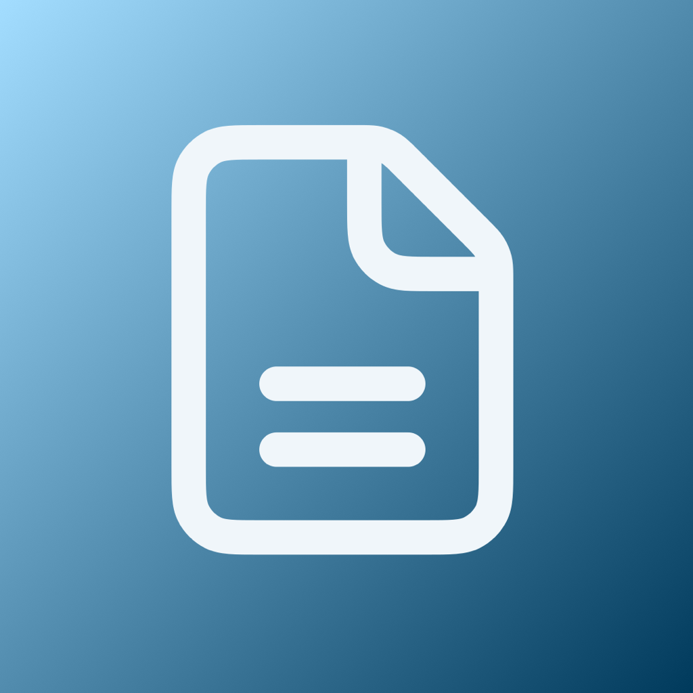
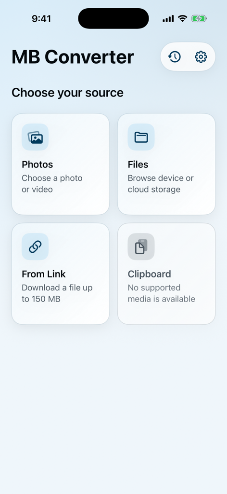
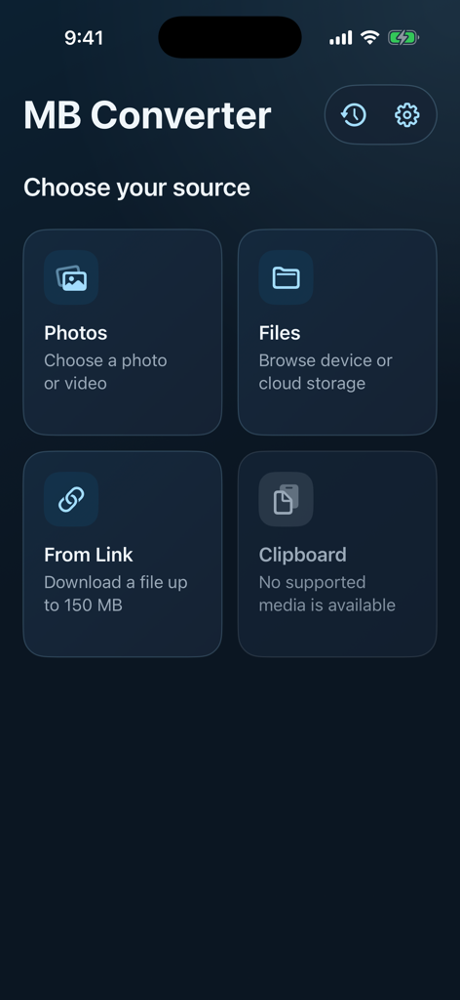

# MB Converter

**Convert and compress photos, videos, and audio on your iPhone or iPad.** Change formats, make files smaller, and save or share the results. Free and open source, with no account required.

## Get MB Converter

[Join the beta on TestFlight](https://testflight.apple.com/join/FEA9U9HB).

Requires **iOS 17 or later** or **iPadOS 17 or later**.

## Make your media easier to share

- **Convert files:** change image, video, and audio formats, extract audio from videos, or turn a GIF into a video or still image.
- **Control file size:** choose a target size for supported formats and adjust resolution, frame rate, or audio settings where available.
- **Make quick edits:** crop and rotate images and videos, and review, edit, or remove metadata before exporting.
- **Import your way:** choose Photos or Files, paste a supported image from the clipboard, or download media from a direct link. Link imports support files up to 150 MB.
- **Save the result:** preview your conversion, compare file sizes, rename it, and save or share it with the system share sheet.
- **Keep useful conversions:** revisit History during your session, or enable saved history to keep conversions across app launches.

<table>
  <tr>
    <td align="center">
      <strong>Light</strong> 
      
    </td>
    <td align="center">
      <strong>Dark</strong> 
      
    </td>
  </tr>
</table>

## Formats

| Media | Common input formats | Save as |
| --- | --- | --- |
| Photos | JPEG, PNG, HEIC, WebP, AVIF, TIFF | JPEG, PNG, HEIC, WebP, TIFF |
| Video | MP4, MOV, M4V, MKV, WebM, AVI, and more | MP4 (H.264 or HEVC), MOV; M4A, AAC, or WAV for audio extraction |
| Audio | MP3, M4A, WAV, AAC, FLAC, OGG, Opus, ALAC | M4A, AAC, WAV |
| Animated GIFs | GIF | MP4 (H.264 or HEVC), or a still JPEG, PNG, HEIC, or TIFF |

Compatibility depends on the encoding inside the file and your device. AV1 video is currently unsupported. Target sizes are estimates; some formats and settings may produce larger files.

## Your files stay under your control

Media conversion runs on your device. Importing from a link connects to the website hosting that file. Save or share anything you want to keep, or turn on saved history in Settings; session-only history is cleared when you quit and reopen the app.

Read the [Privacy Policy](PRIVACY.md) for details about local storage, diagnostics, downloads, and sharing.

## Help and feedback

[Report a problem or request a feature](https://github.com/Marginally-Better-Apps/MB-converter/issues). Include your device, iOS version, and the input and output formats. If you share an error report from Settings, review it first: it can include file names, paths, and media details.

Want to build and run the app yourself? Follow the [build guide](docs/DEVELOPMENT.md).

Explore more apps at [Marginally Better](https://marginally-better.app).
