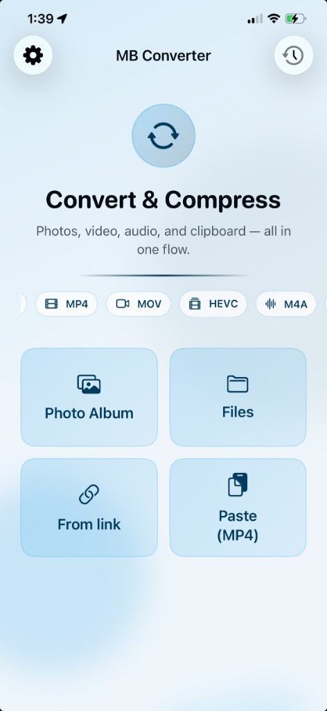
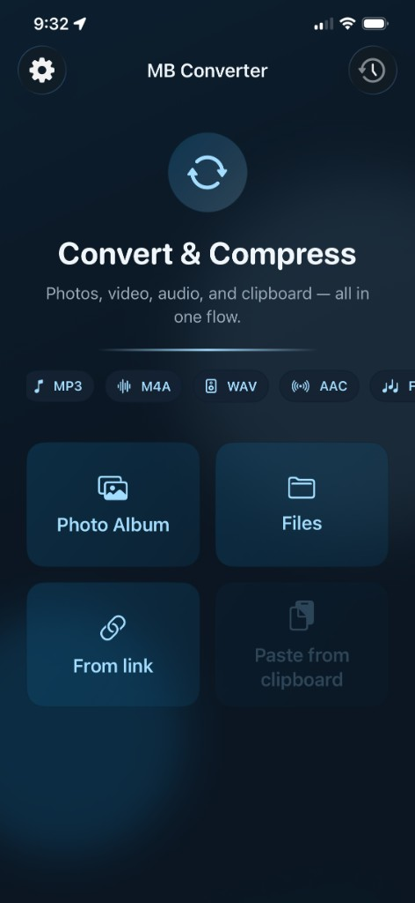

# MB Converter

**Convert and compress** photos, video, and audio on your iPhone and iPad.

This repository’s **shipping app is Expo / React Native** (iOS / iPadOS 17+). The previous SwiftUI app remains under [`legacy/swift/`](legacy/swift/) as a domain and FFmpeg behavior reference until cutover sign-off.

## Get the beta

<p>
  <a href="https://testflight.apple.com/join/FEA9U9HB">
    
  </a>
</p>

**App Icon**


**Main Screen Preview** (legacy Swift screenshots — Expo UI is similar; refresh when convenient)

<table>
  <tr>
    <td align="center">
      <strong>Light</strong><br />
      
    </td>
    <td align="center">
      <strong>Dark</strong><br />
      
    </td>
  </tr>
</table>

## Develop (Expo)

Requires **Node 20+**, **Xcode 26.4+** (Expo SDK 57 / Swift 6.3), and an **iOS 17+** Simulator.

**Custom Dev Client required.** FFmpeg and ImageIO encode modules do **not** run in Expo Go. Always use `npx expo run:ios` or an EAS development build.

```sh
npm install
./scripts/download-ffmpeg-frameworks.sh   # once; vendors FFmpegKit min.v5.1.2.6 xcframeworks
npm test                                   # Jest unit + component tests
npx expo run:ios                           # prebuild + Dev Client (download also runs via config plugin)
npm start                                  # Metro only — pair with an installed Dev Client
```

### Tests & CI

| Command / workflow | What it covers |
|--------------------|----------------|
| `npm test` | Unit + component tests (also the GitHub Actions `unit` job) |
| Maestro `e2e/*.yaml` | Simulator smoke / navigation (CI `e2e` job; **excludes** `e2e/demo/`) |
| `./scripts/record-demo.sh e2e/demo/full-flow.yaml …` | Headed final demo (full encode path; not in CI) |
| `.github/workflows/ci.yml` | `unit` on Ubuntu + `e2e` on macOS-26 / Xcode 26.4+ |
| `.github/workflows/ipa-unsigned.yml` | Unsigned IPA artifact |

FFmpeg binaries are downloaded (not committed). See [`AGENTS.md`](AGENTS.md) and [`CREDITS.md`](CREDITS.md) (LGPL). In-app notice: Settings → **Credits & LGPL notice**.

Bundle ID: `com.marginallybetter.converter` · Display name: **MB Converter**

Agent / port notes: [`AGENTS.md`](AGENTS.md). Legacy Swift developer docs: [`legacy/swift/docs/DEVELOPMENT.md`](legacy/swift/docs/DEVELOPMENT.md).

## License

The app’s source code is under the [MIT License](LICENSE). FFmpeg / FFmpegKit retain LGPL (and related) terms — see [`CREDITS.md`](CREDITS.md).

## More projects

Check out our other projects at [marginally-better.app](https://marginally-better.app).
