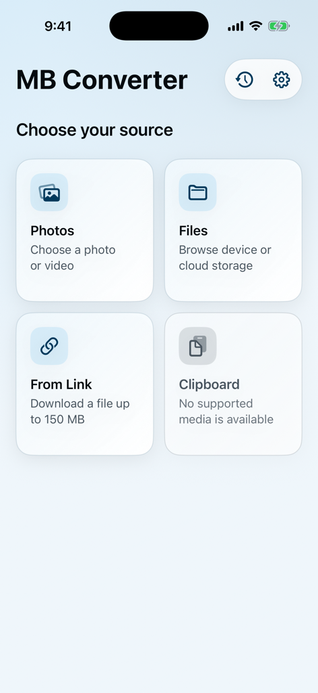
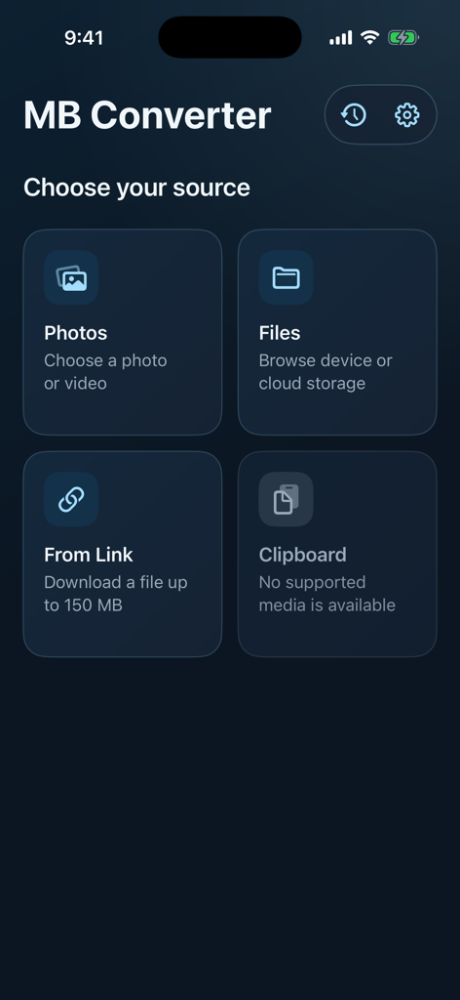

# MB Converter

**Convert and compress documents, photos, videos, audio, and data on your iPhone or iPad.** Change formats, make files smaller, and save or share the results. Free and open source, with no account required.

## Get MB Converter

[Download MB Converter on the App Store](https://apps.apple.com/us/app/mb-converter/id6763943720).

Requires **iOS 17 or later** or **iPadOS 17 or later**.

## Make your media easier to share

- **Convert files:** change media formats, extract audio or frames, convert PDF and Word documents, or turn CSV, TSV, and JSON into another data format.
- **Work with PDFs:** select or rotate pages, merge PDFs, export pages as images, compress scans, and recognize scanned text on device.
- **Image tools:** remove backgrounds, resize with 2× or 4× upscaling, and export modern or older image formats when your device supports them.
- **Batch and compress:** select several files, convert them with one action, or wrap any file in ZIP or GZIP.
- **Control file size:** choose a target size for supported formats and adjust resolution, frame rate, or audio settings where available.
- **Make quick edits:** crop and rotate images and videos; trim supported videos; trim audio and adjust its volume, speed, or channels; and review, edit, or remove metadata before exporting.
- **Import your way:** choose Photos or Files, paste a supported image from the clipboard, or download media from a direct link. Link imports support files up to 150 MB.
- **Save the result:** preview your conversion, compare file sizes, rename it, and save or share it with the system share sheet.
- **Resume drafts:** unfinished work and its source file save automatically in History. Resume after leaving or relaunching; swipe to delete a draft. Completed history can also persist when enabled in Settings.

<table>
  <tr>
    <td align="center">
      <strong>Light</strong> 
      
    </td>
    <td align="center">
      <strong>Dark</strong> 
      
    </td>
  </tr>
</table>

## Formats

| Media | Common input formats | Save as |
| --- | --- | --- |
| Photos | JPEG, PNG, HEIC, WebP, AVIF, TIFF, and more | JPEG, PNG, HEIC, WebP, TIFF, BMP, ICO, JPEG 2000, AVIF, TGA, PSD, EXR, ICNS; PDF or recognized text |
| Video | MP4, MOV, M4V, MKV, WebM, AVI, AV1-encoded video, and more | MP4 (H.264 or HEVC), MOV, WebM (VP9/Opus); supported audio formats for extraction |
| Audio | MP3, M4A, WAV, AAC, FLAC, OGG, Opus, ALAC, AIFF, CAF, and more | MP3, FLAC, OGG/Vorbis, Opus, M4A, AAC, WAV, ALAC, AIFF, CAF |
| Animated GIFs | GIF | MP4 (H.264 or HEVC), or a still JPEG, PNG, HEIC, or TIFF |
| Documents | PDF, DOCX, ODT, RTF, TXT, Markdown, HTML | PDF, DOCX, ODT, RTF, TXT, Markdown, HTML; Pages as JPEG or PNG |
| Data | CSV, TSV, JSON arrays of objects | CSV, TSV, JSON, TXT, PDF |
| Any file | Files selected in the system picker | ZIP or GZIP |

Compatibility depends on the encoding inside the file and your device. AV1 input is supported; AV1 output is not offered. Previews use FFmpeg when native decoding is unavailable: thumbnails load automatically, and tapping Play prepares a compatible temporary copy with progress and cancellation. The original file stays unchanged. Target sizes are estimates; some formats and settings may produce larger files.

Word and OpenDocument conversions preserve editable text, not page layout, tables, or embedded images. Scanned text recognition depends on scan quality. Image upscaling uses Lanczos resampling. ZIP and GZIP creation is supported; general archive extraction is not. See [conversion details](docs/CONVERSION_EXPANSION.md).

## Your files stay under your control

Conversion, compression, OCR, and image tools run on your device. Apple Maps can load map tiles and search results when editing location metadata; it never receives the source file. Importing from a link connects to the website hosting that file. Save or share anything you want to keep, or turn on saved history in Settings; session-only completed history is cleared when you quit and reopen the app. Drafts remain until completed or deleted.

Read the [Privacy Policy](PRIVACY.md) for details about local storage, diagnostics, downloads, and sharing.

## Help and feedback

[Report a problem or request a feature](https://github.com/Marginally-Better-Apps/MB-converter/issues). Include your device, iOS version, and the input and output formats. If you share an error report from Settings, review it first: it can include file names, paths, and media details.

Want to build and run the app yourself? Follow the [build guide](docs/DEVELOPMENT.md). See the [changelog](CHANGELOG.md) for version 1.1 changes.

Explore more apps at [Marginally Better](https://marginally-better.app).
