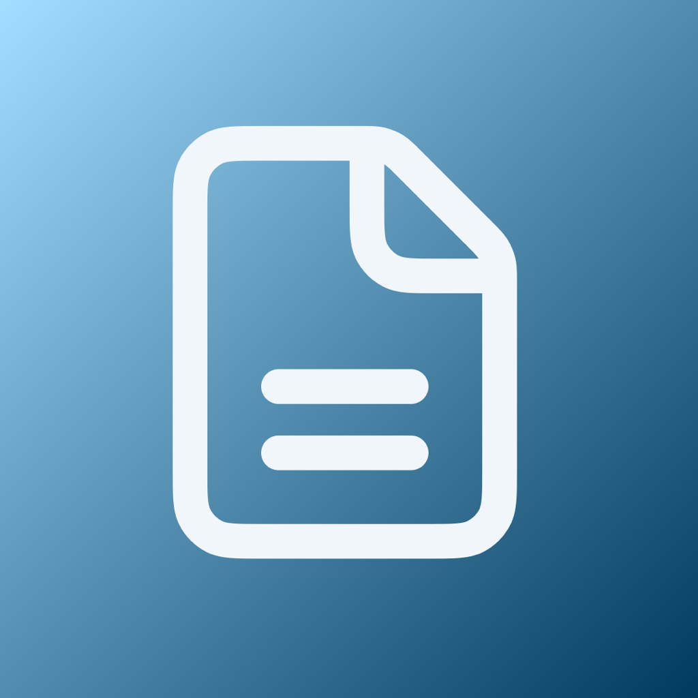
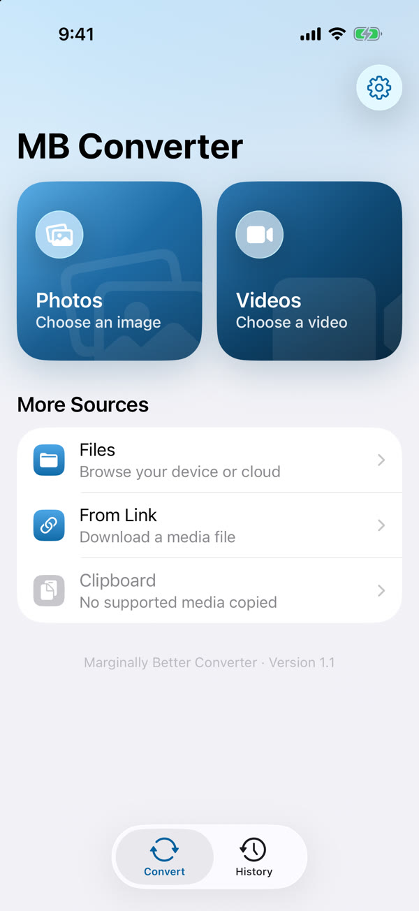
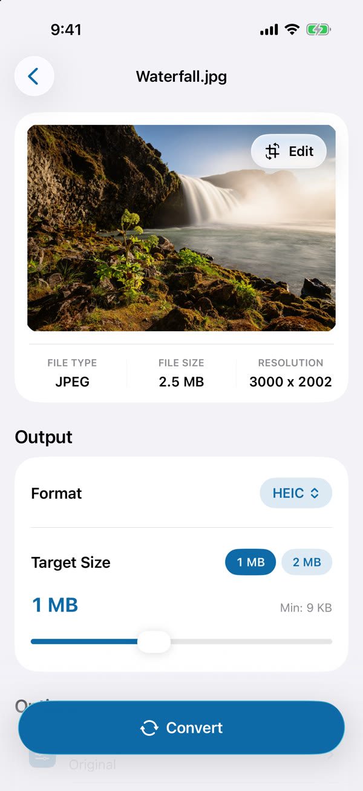
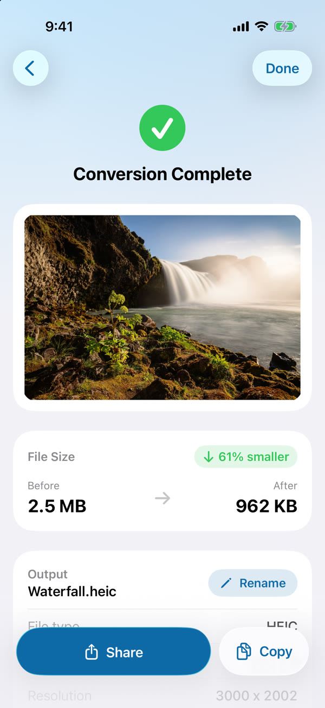
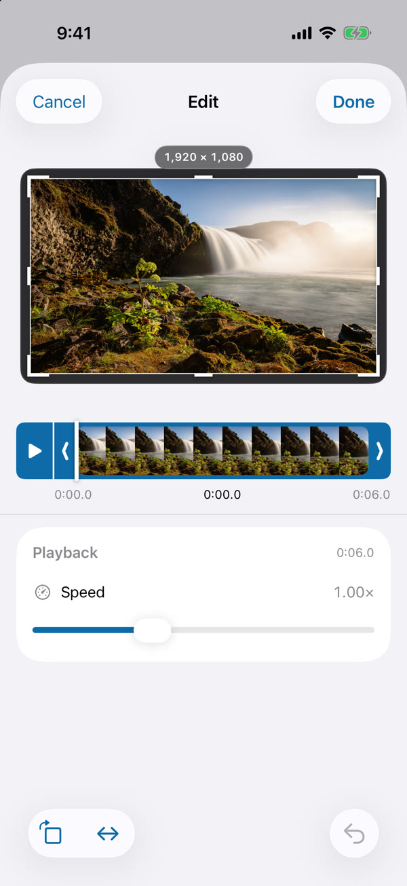
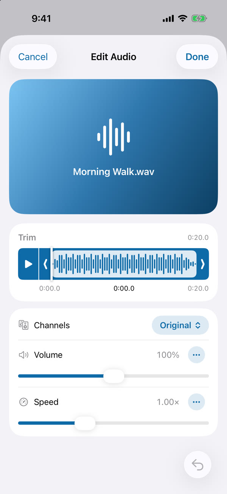
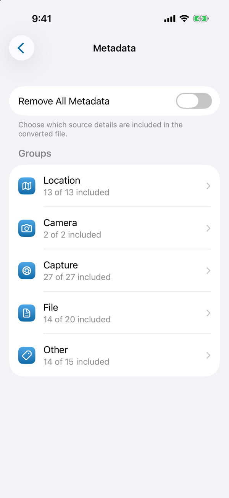
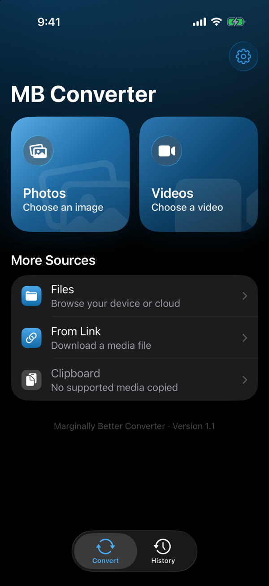
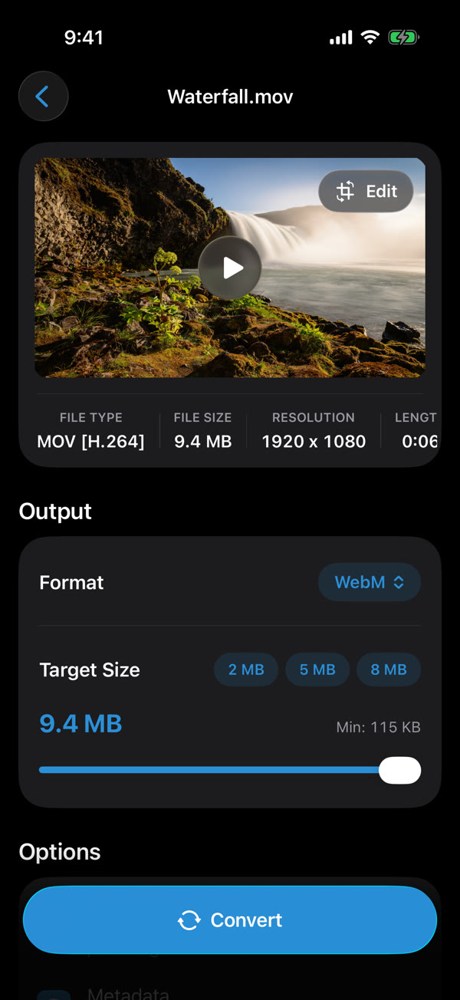

# MB Converter

**Convert and shrink photos, videos, and audio on your iPhone or iPad.** Free, open source, and no account needed.

<a href="https://apps.apple.com/us/app/mb-converter/id6763943720" target="_blank" rel="noopener noreferrer"><strong>Download on the App Store</strong></a> · iOS / iPadOS 17 or later

  
  
  

## How it works

1. **Pick something**: from Photos, Files, a link, or your clipboard.
2. **Choose a format and size**: tap 1 MB, 5 MB, or drag the slider.
3. **Convert, then share or save.** You'll see how much smaller it got.

## Edit before you export

  
  
  

- **Photos and videos:** crop, rotate, and trim.
- **Audio:** trim, and change the volume, speed, or channels.
- **Live Photos:** pick a different key photo, or save the motion as a video.
- **Privacy:** remove location and camera details, or all metadata, in one tap.

## Formats

| | Save as |
| --- | --- |
| 📷 Photos | JPEG, PNG, HEIC, WebP, TIFF |
| 🎬 Videos | MP4 (H.264 / HEVC), MOV, WebM |
| 🎵 Audio | MP3, M4A, AAC, WAV, FLAC, Ogg, Opus |
| 🎞️ GIFs | MP4, or a still image |

It opens most common files, including MKV, AVI, AV1, WebP, AVIF, and FLAC. You can also pull the audio out of any video.

## Light or dark

  
  

## Private by design

Everything is converted on your device. Nothing is uploaded. History is cleared when you close the app, unless you turn on **Save Conversion History** in Settings. Read the [Privacy Policy](PRIVACY.md).

## Help

Something not working? [Open an issue](https://github.com/Marginally-Better-Apps/MB-converter/issues) and tell us your device, iOS version, and the file types involved.

---

[What's new](CHANGELOG.md) · [Build it yourself](docs/DEVELOPMENT.md) · [More apps from Marginally Better](https://marginally-better.app)
